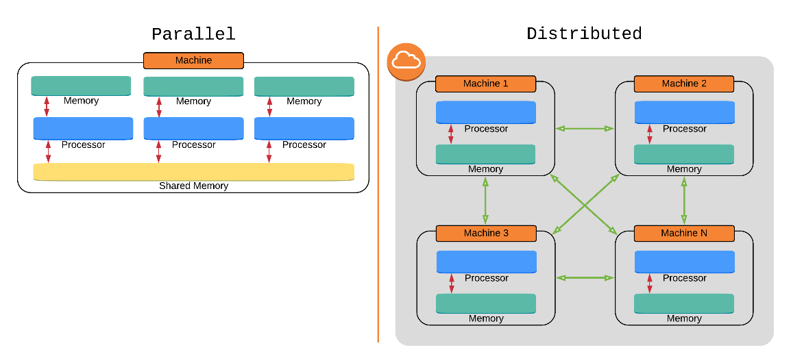
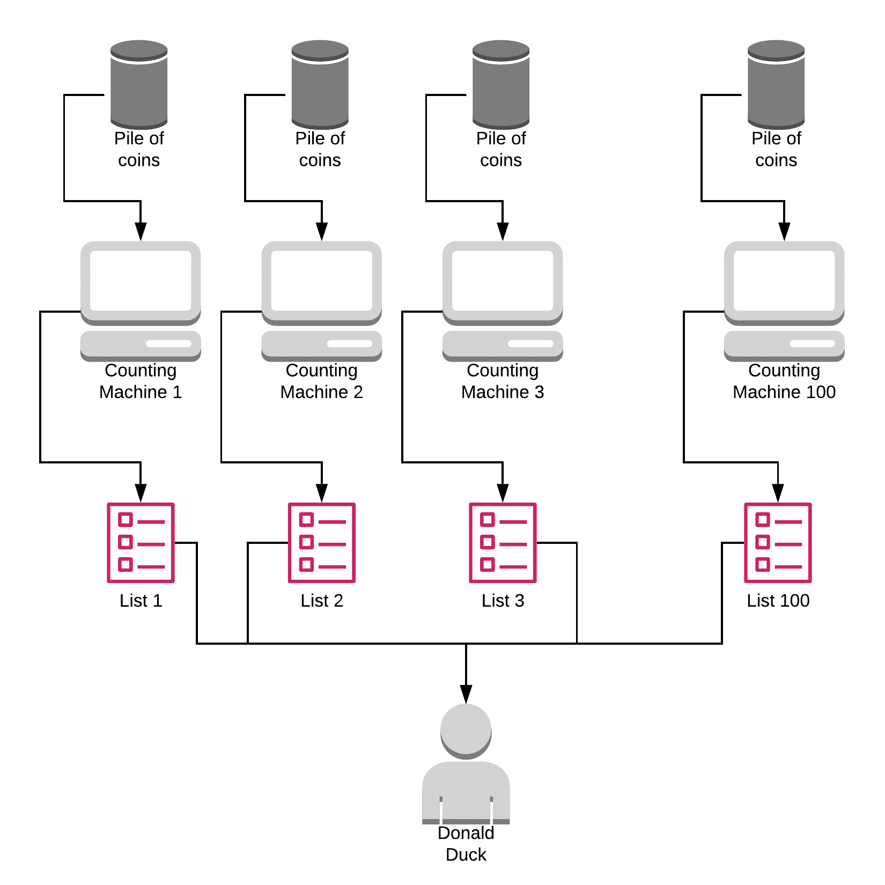

# Explaining MapReduce

- _데이터 분석을 위한 분할-적용-결합_ 전략

[맵리듀스 위키피디아](https://en.wikipedia.org/wiki/MapReduce#Overview)

MapReduce에는 여러 가지 구현 
{ Apache Hadoop, Hive, CloudDB , Infinispan} 분산 리소스를 조율하여 작업을 해결하는 도구를 제공하기 위해 MapReduce를 사용하는 여러 제품이 있다

# Infinispan
_[Infinispan은 JBoss Cache](https://en.wikipedia.org/wiki/JBoss_Cache "JBoss Cache") 의 후속 제품

- 특징
	- Transactions
	- [MapReduce](https://en.wikipedia.org/wiki/MapReduce "MapReduce")
	- Support for [LRU](https://en.wikipedia.org/wiki/Least_recently_used "Least recently used") and [LIRS](https://en.wikipedia.org/wiki/LIRS_caching_algorithm "LIRS caching algorithm") [eviction algorithms](https://en.wikipedia.org/wiki/Cache_eviction "Cache eviction")
	- Through pluggable architecture, infinispan is able to persist data to filesystem, [relational databases](https://en.wikipedia.org/wiki/Relational_database_management_system "Relational database management system") with [JDBC](https://en.wikipedia.org/wiki/JDBC "JDBC"), [LevelDB](https://en.wikipedia.org/wiki/LevelDB "LevelDB"), NoSQL databases like [MongoDB](https://en.wikipedia.org/wiki/MongoDB "MongoDB"), [Apache Cassandra](https://en.wikipedia.org/wiki/Apache_Cassandra "Apache Cassandra") or [HBase](https://en.wikipedia.org/wiki/HBase "HBase") and others.[[5]](https://en.wikipedia.org/wiki/Infinispan#cite_note-5)

- Usage
	- [분산 캐시](https://en.wikipedia.org/wiki/Distributed_cache "분산 캐시") , [[ 1 ]](https://en.wikipedia.org/wiki/Infinispan#cite_note-FOOTNOTEAdamski2018383%E2%80%93384Chapter_%C2%A715_Sharing_the_Web_Sessions_-_Infinispan-1) [종종 데이터베이스](https://en.wikipedia.org/wiki/Database "Database") 앞에 위치
	- [웹 세션](https://en.wikipedia.org/wiki/Session_(computer_science) "Session (computer science)") 과 같은 임시 데이터의 저장 "세션(컴퓨터 과학)")
	- 메모리 내 [데이터 처리](https://en.wikipedia.org/wiki/Data_processing "데이터 처리") 및 [분석](https://en.wikipedia.org/wiki/Analytics "해석학")
	- [JVM](https://en.wikipedia.org/wiki/Java_virtual_machine "자바 가상 머신") 간 통신 및 공유 스토리지
	- 메모리 내 데이터 그리드에서의 MapReduce 구현.
	- Infinispan은 학계와 연구에서 분산 실행 및 저장을 위한 프레임워크로도 사용됩니다.
	- Cloud2Sim [[ 6 ]](https://en.wikipedia.org/wiki/Infinispan#cite_note-6) 은 MapReduce 워크플로 및 시뮬레이션의 분산 실행을 위해 Infinispan을 활용합니다.
	- 의료 영상 아카이브를 위한 MEDIator 데이터 공유 동기화 플랫폼 [[ 7 ]](https://en.wikipedia.org/wiki/Infinispan#cite_note-7) 은 분산형 메모리 내 저장소이자 분산형 실행 프레임워크로 Infinispan을 활용합니다.
	- Cassowary [[ 8 ]](https://en.wikipedia.org/wiki/Infinispan#cite_note-8) 는 컨텍스트 인식 스마트 빌딩을 위한 미들웨어 플랫폼을 제공하기 위해 Infinispan을 사용하여 컨텍스트 정보를 메모리 내에 저장합니다.

**MapReduce 는** [클러스터](https://en.wikipedia.org/wiki/Cluster_(computing) "클러스터(컴퓨팅)") 에서 [병렬](https://en.wikipedia.org/wiki/Parallel_computing "병렬 컴퓨팅") 분산 알고리즘을 [사용 하여](https://en.wikipedia.org/wiki/Distributed_computing "분산 컴퓨팅") [대용량 데이터](https://en.wikipedia.org/wiki/Big_data "빅데이터") 세트를 처리하고 생성하기 위한 [프로그래밍 모델](https://en.wikipedia.org/wiki/Programming_model "프로그래밍 모델") 이자 관련 구현 입니다

MapReduce 프로그램은 필터링과 정렬(예: 학생을 이름순으로 큐에 정렬, 각 이름당 하나의 큐)을 수행하는 [_map_](https://en.wikipedia.org/wiki/Map_(parallel_pattern) "지도(평행 패턴)") [프로 시저와 요약 작업(예: 각 큐에 있는 학생 수를 세어 이름 빈도를 산출)을 수행하는](https://en.wikipedia.org/wiki/Procedure_(computing) "절차(컴퓨팅)") _[reduce](https://en.wikipedia.org/wiki/Reduce_(parallel_pattern) "줄이기 (병렬 패턴)")_ 메서드로 구성됩니다. "MapReduce 시스템"(또한 "인프라" 또는 "프레임워크"라고도 함)은 분산 서버를 [마샬링 하고, 다양한 작업을 병렬로 실행하고, 시스템의 다양한 부분 간의 모든 통신과 데이터 전송을 관리하고,](https://en.wikipedia.org/wiki/Marshalling_(computer_science) "마샬링(컴퓨터 과학)") [중복성](https://en.wikipedia.org/wiki/Redundancy_(engineering) "중복성(엔지니어링)") 과 [내결함성을](https://en.wikipedia.org/wiki/Fault-tolerant_computer_system "내결함성 컴퓨터 시스템") 제공하여 처리를 조율합니다

## Parallel vs Distributed

일반적으로 병렬 컴퓨팅 이라는 용어는 동일한 시스템의 여러 CPU에서 실행되는 계산, 즉 멀티스레딩만을 다룹니다

병렬 컴퓨팅은 단일 머신의 CPU 수에 의해 제한되는 반면, 분산 컴퓨팅은 시스템을 확장하고 거대한 데이터 세트를 처리하는 더 나은 접근 방식입니다. 반면, 데이터 세트가 단일 머신의 메모리에 들어갈 수 있다면, 병렬 컴퓨팅 접근 방식의 결과는 훨씬 더 빠릅니다. 왜냐하면 프로세스가 공유 메모리를 통해 통신할 수 있기 때문입니다. 반면, 분산 시스템의 노드는 네트워크를 통해 정보를 교환해야 합니다(이 글을 쓰는 시점에서 대기 시간 [1] 은 100ns 대 150ms [2] 입니다. 10 6 배 )
> [!Tip] 
> 유일한 차별 요소는 우리가 사용하는 알고리즘이 아니라 입력 크기와 필요한 리소스입니다.

## First Map, Then Reduce
병렬화 연산
수백개의  동전을 계산하는 방법

싱글 연산
혼자서 동전의 가치별로 나누고 각각을 계산 후 합산

병렬 연산
가족들에게 메일로 개수를 전달 후 수신 개별 합산

지도를 만들고 축소하기

## There is More, Under the Hood