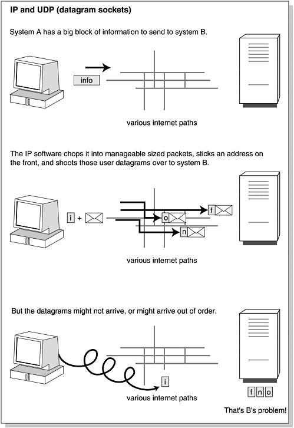

# TCP/IP에 대해 알아야 할 모든 것

네트워킹의 핵심은 A 지점에서 B 지점으로 비트를 이동하는 것입니다 

이것이 인터넷 프로토콜 또는 IP입니다
데이터 비트를 패킷으로 묶고, 더 많은 비트를 추가하여 어디로 가야 하는지 말합니다. 

"사용자 데이터그램" 또는 "패킷"
단일 패킷에 들어갈 수 있는 것보다 더 많은 비트를 보내려면 비트를 그룹으로 나누어 여러 개의 연속 패킷으로 보낼 수 있습니다. 보내는 단위를 "사용자 데이터그램" 또는 "패킷"이라고 합니다. 요즘은 패킷이라는 용어가 더 일반적입니다.
> 

TCP 위에서 실행되거나 TCP를 사용하는 두 가지 애플리케이션은 FTP(파일 전송 프로토콜) 및 Telnet입니다.

TCP는 라우팅 및 비트를 올바른 주소로 전달하기 위해 기본 프로토콜로 IP를 사용합니다

"올바른 주소"는 IP 주소를 의미하며 인터넷의 모든 컴퓨터에는 IP 주소가 있습니다
그러나 TCP는 전송 세션 동안 엔드투엔드 연결을 지원한다는 점에서 등록 우편 배달보다는 전화 통화에 더 가깝습니다.

