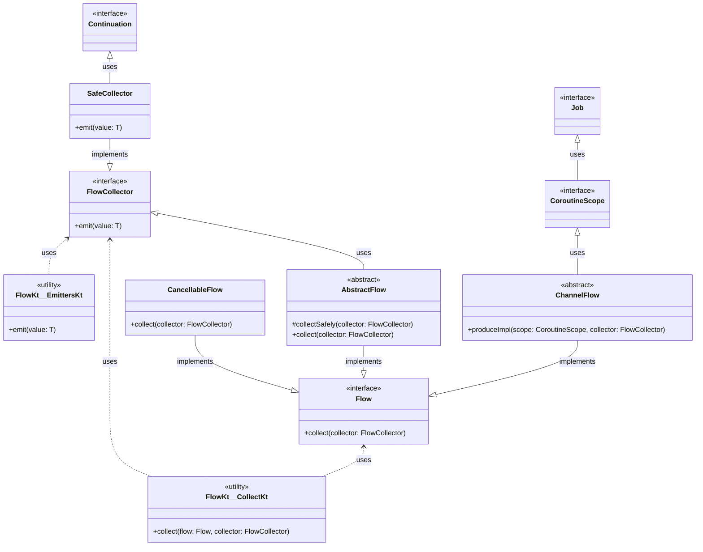

# kotlinx-coroutines-core

## `package` : _`kotlinx.coroutines.flow`_

### `Classes`
> **`Flow`**, **`FlowCollector`**, **`AbstractFlow`**, **`ChannelFlow`**, **`SafeCollector`**, **`CancellableFlow`**, **`FlowKt__CollectKt`**, **`CoroutineScope`**, **`Job`**, **`Continuation`**, **`FlowKt__EmittersKt`**

### Package Contents
> Class Details

| Class               | Type       | Methods                                      |
|---------------------|------------|----------------------------------------------|
| Flow                | Interface  | + collect(collector: FlowCollector)          |
| FlowCollector       | Interface  | + emit(value: T)                             |
| AbstractFlow        | Abstract   | # collectSafely(collector: FlowCollector)    |
|                     |            | + collect(collector: FlowCollector)          |
| ChannelFlow         | Abstract   | + produceImpl(scope: CoroutineScope, collector: FlowCollector) |
| SafeCollector       |            | + emit(value: T)                             |
| CancellableFlow     |            | + collect(collector: FlowCollector)          |
| FlowKt__CollectKt   | Utility    | + collect(flow: Flow, collector: FlowCollector) |
| CoroutineScope      | Interface  |                                              |
| Job                 | Interface  |                                              |
| Continuation        | Interface  |                                              |
| FlowKt__EmittersKt  | Utility    | + emit(value: T)                             |