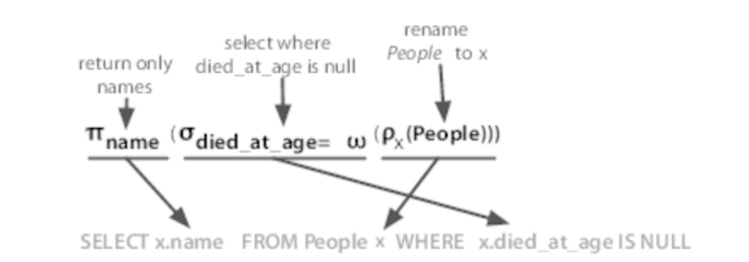

# 세븐데이터
- `PostgreSQL`, `Apache HBase`, `MongoDB`, `Apache CouchDB`, `Neo4J`, `DynamoDB`, `Redis`
- MapReduce
- NoSql
    - 스키마 없는 설계
    - 수평 확장
    - 
-해결 과제
    - 유창한쿼리 vs 빠른 쿼리
    - 절대 일관성 vs 최종 일관성
    - 선택 기준과 방법은?

## 데이터베이스 선택과 조합의 결정 방법

- 1.데이터베이스의 유형 범주
    - 관계형 {posrgre}
    - 키-값 { redis}
    - 컬럼형 { Hbase,cassandra} : 여러머신 과 연결되어 대량 데이터 저장 (데이터관계약함) 
    - 문서지향형 { Mongodb, couchdb}
    - 그래프형 {neo4j}
    - 하이브리드 클라우드 기반 {DynamoDB}

- RDBMS
    - 쿼리의 유연성

### 데이터베이스 별 차별점
- 데이터베이스 별 기능 특징 
    - 임의 필드 쿼리 
    - 쿼리 계획 정의
    - 스키마 유연
    - 스키마 제약
    - 샤딩 지원
    - 복제 로직
    - 일관된 해싱과 일관된 분산
    - 커스터마이징 제어권
    - 확장성
        - 수평적{Mongodb, hbase , dynamodb}
        - 전통적 { postgres ,neo4j , redis }
        - 중간 {?}
- 요약 : 
    - 기능과 제약조건에 따라 적합한 작업을 수행하는 데이터베이스 선택
    - 데이터 베이스별 차이점에 대한 이해

### 장르

 5가지 특정 상황에 따른 데이터베이스 설명

 - 관계형 RDBMS
    - postgres 
        - SQL 표준 준수
    - 행과열(col,row) 2d Table 집합 이론기반 시스템
    - 표준은 구조화된 쿼리 작업
    - 데이터 값 유형 명시 시스템 강제 적용
    - 수학적 집합 이론 기반 테이블 결합 생성 변형

- 키-값 저장소 { "Key" : "Value" }
    - memcashed,riak,redis,dynamodb
    - Redis
        - 정렬된 집합 및 해시(복잡한 데이터 휴형)
        - Pub/Sub
        - 차단 큐 메시지 
        - 빠른 성능
        - 단점 : 
            - 커밋전 메모리 쓰기 캐싱 하드웨어 장애시 데이터 손실 위험 증가

     - 프로그래밍 언의의 Map,HashTable 유사한 키값 페어링
     - 권장하지 않는 사용 방법 
        - 복잡한 쿼리 및 집계 요구사항 필요한 경우

- 컬럼형
    - Hbase, cassandra
    - 컬럼 추가비용이 저렴 행단위로 작업
    - 각행은 다른 열집합을 소유할수 있다
    - 널 값에 대한 저장 비용이 없다
    - 널 값에 대한 희소성 유지가능
    - 관계형과 키값의 중간 형태

- 문서형
    - mongodb
        - 대용량으로 설계
        - 일관성 유지
        - 구조적 쿼리
        - 원자적 읽기쓰기
        - 복잡한 MapReduce 지원
        - 기본 언어는 자바스크립트

    - 문서형태 저장
    - 해시와 같음 
    - 고유id 필드, 다양한 유형
    - 중첩 구조를 포함할수 있다
    - 높은 유연성
    - 데이터에 대한 제약이 거의 없다

- 그래프형
    - Neo4j
        - 자기참조와 복잡한 연결 데이터 크롤링
        - 노드관계를 찾아 관련데이터 조회
        - 소셜 네트워킹 앱에서 인기

    - 상호 연결된 데이터 처리
    - 노드와 노드관계 구조
    - 노드를 탐색한다

# 관계형 테이터베이란?
 관계를 포함하는 데이터베이스
 테이블은 속성을 원자 값에 매핑 하는 집합이다
 수학에 기반한 관계형
 
 관계대수
    - SELECTION
        - WHERE
    - PROJECTION
        - SELECT
    - 데카르트 곱
        - JOIN

ss

