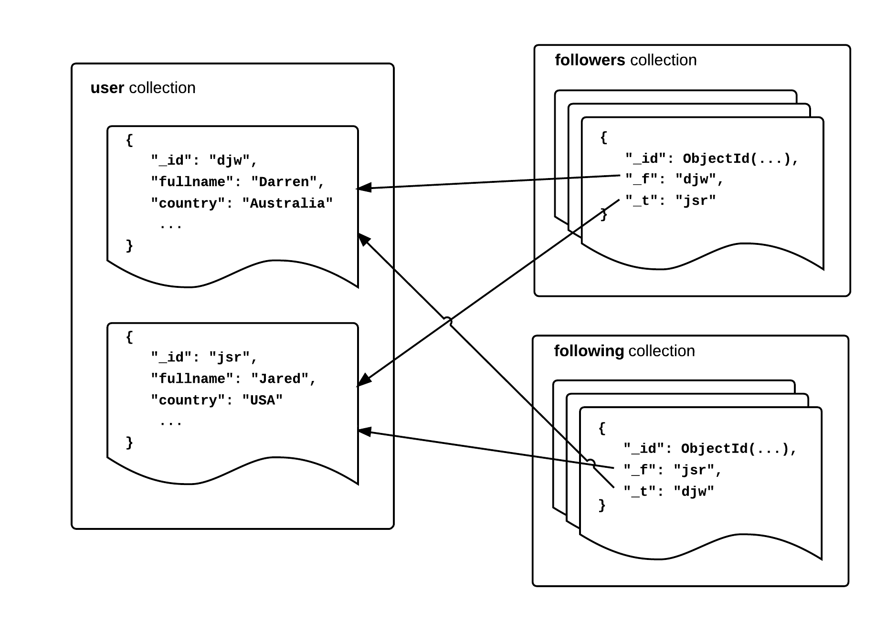
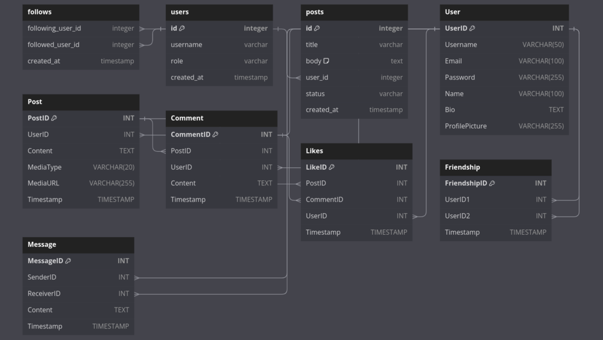

##  소셜 미디어 플랫폼 기능
- 사용자 관리: 개인 정보, 인증 자격 증명, 개인정보 보호 설정을 비롯한 사용자 프로필을 효율적으로 관리합니다.
- 콘텐츠 관리: 사용자가 공유한 게시물, 사진, 비디오, 링크 등 다양한 유형의 콘텐츠를 저장하고 정리합니다.
- 소셜 그래프: 우정 관계, 팔로워 관계, 팔로잉 관계를 포함한 사용자 간의 관계를 나타냅니다.
상호작용 추적: 좋아요, 댓글, 공유, 조회수 등 콘텐츠와 사용자의 상호작용을 기록합니다.
- 메시징 시스템: 사용자가 서로에게 개인 메시지를 보낼 수 있도록 하여 실시간 커뮤니케이션을 지원합니다.
- 분석 및 추천: 사용자 행동과 선호도를 분석하여 개인화된 콘텐츠 추천 및 통찰력을 제공합니다.
 
 
## Facebook은 다음과 같은 유형의 데이터베이스를 사용합니다.

- 데이터 저장을 위한 RocksDB
- 데이터 관리를 위한 Velox
- 모든 소셜 데이터를 저장하기 위한 MySQL 데이터베이스
- 빅데이터 등을 위한 Apache Hadoop 


## 키-값 or 문서 데이터베이스
> 실시간 알림 , 업데이트
- 사용자가 데이터를 쉽게 추가, 삭제 또는 편집할 수 있기 때문에 빈번한 업데이트에 가장 적합합니다. 


단순함을 우선시하세요
데이터 정규화
데이터베이스의 데이터 속성 간의 관계
사용자 이름을 소유자의 위치 또는 거래 내역에 연결
데이터 무결성 유지 검증
데이터베이스 설계 프로세스의 각 단계를 문서화하는 습관
전문화된 데이터베이스의 다이어그램


팔로워 그래프

- 작성자(해당 사용자의 팔로워)의 게시물을 수신하는 사용자 타임라인을 결정

사용자가 다른 사용자를 팔로우하고 언팔로우하기로 선택함에 따라 그래프 내에서 상당한 이탈이 발생할 수도 있습니다. 이러한 이유로 이 서비스는 상당한 읽기 및 쓰기 부하에 맞게 확장되도록 신중하게 설계되어야 합니다.

### 스키마 디자인

- 기본적으로 users, followers, following이라는 3개의 MongoDB 컬렉션을 사용합니다.
- users 컬렉션은 일반적인 사용자 엔터티 데이터(createUser 호출 중에 제공된 userId 및 기타 세부 정보)를 추적합니다.



이 컬렉션에서는 여러 가지 이유로 _ id 필드를 사용하여 userId를 저장합니다.

* _ id 필드 는 고유해야 하며 이는 userId에 대한 유효한 제약 조건입니다.
* userId는 어차피 인덱싱될 가능성이 높으므로 별도의 인덱스를 업데이트하지 않아도 됩니다.
* userId는 좋은 분포를 갖게 되고 _ id 인덱스를 샤딩에 재사용할 수 있으므로 이 컬렉션에 대한 좋은 샤드 키가 됩니다.


# 예시#1
- 이 접근 방식의 확실한 장점은 사용자의 모든 팔로워/팔로잉 정보를 단일 문서만 읽으면 찾을 수 있다는 점입니다. 하지만 이 설계에는 몇 가지 심각한 문제가 있습니다.

> - 팔로워가 추가되면 문서 크기가 변경됩니다. 문서 크기를 조정하면 MongoDB에서 쓰기 오버헤드가 발생하는 경우가 많습니다.
> - MongoDB에서 문서 크기 제한에 접근함에 따라 사용자가 가질 수 있는 팔로워 수에는 궁극적으로 제한이 있습니다.
> - 이 디자인으로 모서리에 주석을 달기가 매우 어렵습니다. 예를 들어, 팔로우하는 사용자를 친구, 직장, 가족 등의 그룹으로 정리하고 싶다고 가정해 보겠습니다. 이 정보를 보관할 자연스러운 장소는 없습니다.


```bash
$ db.users.findOne()

{ 
    "_id" : "djw",
    "fullname" : "Darren Wood"
    "country" : "Australia",
    "followers" : [ "jsr", "ian”],
    "following" : [ "jsr", "pete"]
}
```

> [!NOTE]
> > 정리 : 
> > 1. 팔로워 추가 시 크기 변경되어 오버헤드 발생  
> > 2. 문서크기 제한으로 팔로워수 한계
> > 3. 그룹정리 어려움 


---

# 스키마 예시 #1




```sql

    UserID INT PRIMARY KEY,
    Username VARCHAR(50) UNIQUE,
    Email VARCHAR(100) UNIQUE,
    Password VARCHAR(255),
    Name VARCHAR(100),
    Bio TEXT,
    ProfilePicture VARCHAR(255)
);


CREATE TABLE Post (
    PostID INT PRIMARY KEY,
    UserID INT,
    Content TEXT,
    MediaType VARCHAR(20),
    MediaURL VARCHAR(255),
    Timestamp TIMESTAMP,
    FOREIGN KEY (UserID) REFERENCES User(UserID)
);


CREATE TABLE Comment (
    CommentID INT PRIMARY KEY,
    PostID INT,
    UserID INT,
    Content TEXT,
    Timestamp TIMESTAMP,
    FOREIGN KEY (PostID) REFERENCES Post(PostID),
    FOREIGN KEY (UserID) REFERENCES User(UserID)
);


CREATE TABLE Like (
    LikeID INT PRIMARY KEY,
    PostID INT,
    CommentID INT,
    UserID INT,
    Timestamp TIMESTAMP,
    FOREIGN KEY (PostID) REFERENCES Post(PostID),
    FOREIGN KEY (CommentID) REFERENCES Comment(CommentID),
    FOREIGN KEY (UserID) REFERENCES User(UserID)
);


CREATE TABLE Friendship (
    FriendshipID INT PRIMARY KEY,
    UserID1 INT,
    UserID2 INT,
    Timestamp TIMESTAMP,
    FOREIGN KEY (UserID1) REFERENCES User(UserID),
    FOREIGN KEY (UserID2) REFERENCES User(UserID)
);


CREATE TABLE Message (
    MessageID INT PRIMARY KEY,
    SenderID INT,
    ReceiverID INT,
    Content TEXT,
    Timestamp TIMESTAMP,
    FOREIGN KEY (SenderID) REFERENCES User(UserID),
    FOREIGN KEY (ReceiverID) REFERENCES User(UserID)
);

```


